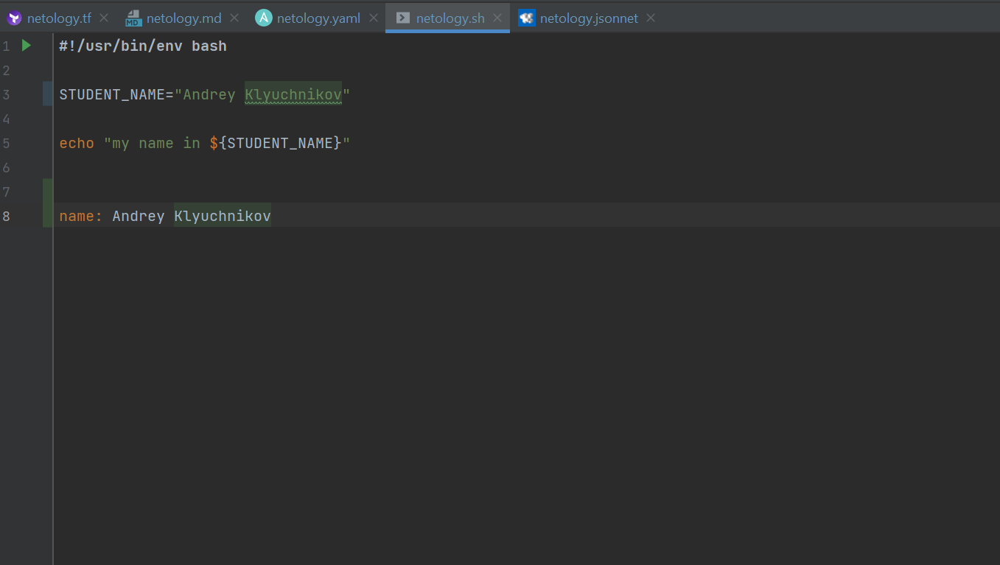

# Задание №1 - Подготовка рабочей среды

## Terraform:

## bash:

## Markdown:

## Yaml:

## Jsonnet:

# Задание №2 - Описание жизненного цикла задачи (разработки нового функционала)

### 1 Шаг: Разработка - Участвют разработчики приложения

### 2 Шаг: Тестирование - Участвуют тестировщики

### 3 Шаг: Безопасность - Специалисты инф. безопасности или Devops (предоставление у/з, настройка политик безопасности)

### 4 Шаг: Выкладка в stage и далее в prod: - Проверка на stage далее в prod, выполняет Devops

### 5 Шаг: Мониторинг - Мониторинг и сопровождение разработанного ПО, работа Devops

***Devops принимает участие в каждом шаге. Сначала предоставляет одинаковые окружения для всех специалистов. Настраивает CI/CD для всей цепочки (Git - test - stage -prod) и далее после выпуска в ОПЭ осуществляет сопровождение и мониторинг системы***

